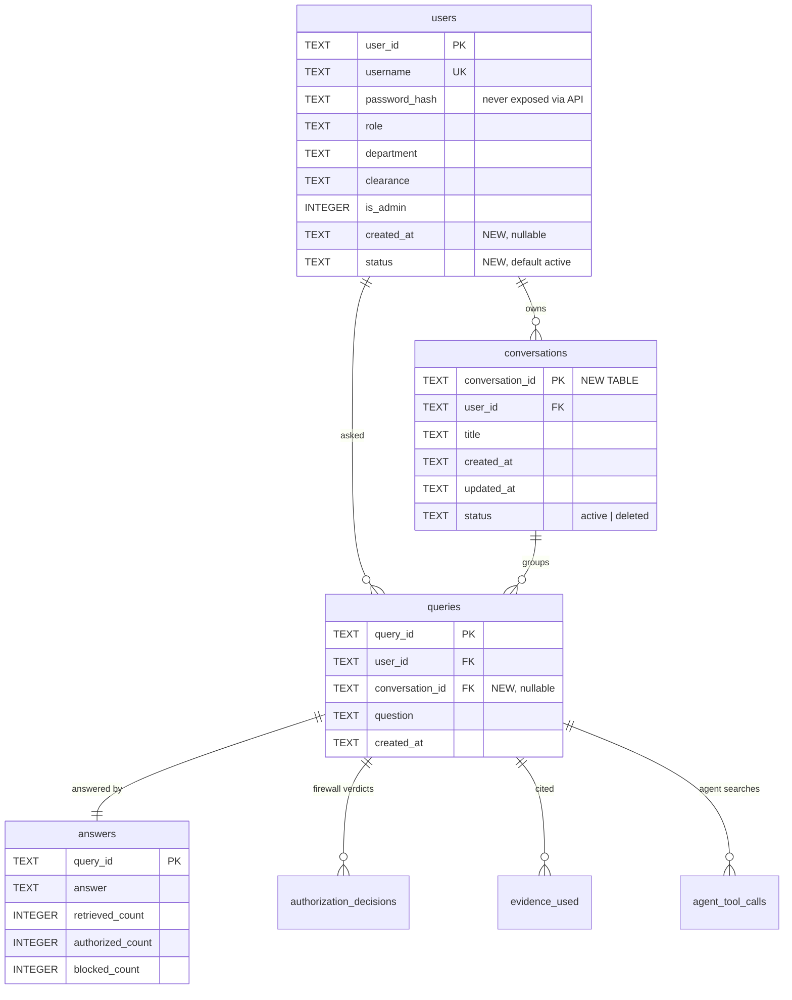

# Feature Implementation Plan

**Status:** Planning only — nothing in this document has been implemented.
**Audience:** Claude Sonnet (implementer), plus any human reviewing the design before build.
**Scope:** Three feature groups — Admin User Management, Admin Query History, Persistent Chat History.

Everything below was derived by inspecting the actual code in this
repository, not from assumption. Where I found a pre-existing bug or an
exposure that affects these features, it's called out explicitly rather
than silently designed around.

---

## 1. Current Architecture Analysis

### Backend

| Aspect | Reality in this repo |
|---|---|
| Framework | FastAPI (`sentinelrag/api.py`), served by uvicorn on port 8000 |
| Language | Python 3.12, venv at `sentinelrag/.venv` (always use `.venv\Scripts\python.exe`) |
| ORM | **None.** Raw `sqlite3` with hand-written SQL |
| Migration system | **None.** See §3 — this is the single most important constraint in this plan |
| API layer shape | `api.py` is one thin file (~230 lines). It contains *only* HTTP concerns: auth, request models, dependencies, routing. All logic lives in `sentinel/` |
| Business logic | `sentinelrag/sentinel/` — 22 modules, provider- and UI-agnostic |
| Concurrency | One shared `SentinelRAGPipeline` instance across FastAPI's threadpool. All repositories use `check_same_thread=False` + a `threading.Lock()` around writes |

**Existing endpoints** (complete list):

```
POST /auth/login          public
POST /auth/signup         public   (hard-locked to Public/Employee/General/non-admin)
GET  /auth/me             authenticated
POST /query               authenticated
POST /documents           admin only   (multipart upload)
GET  /documents           admin only
GET  /audit/{query_id}    authenticated (redacted by role — see §2)
```

**Module map** (files relevant to this plan):

```
sentinelrag/
├── api.py                      FastAPI app, all routes, module-level singletons
├── seed.py                     demo users + demo corpus (the only "admin tooling" today)
├── conftest.py                 empty — exists purely to put root on sys.path for pytest
└── sentinel/
    ├── auth.py                 bcrypt hashing + JWT encode/decode
    ├── user_repository.py      users table, SQLite
    ├── document_repository.py  documents table, SQLite
    ├── audit.py                queries/answers/decisions/evidence/tool_calls tables
    ├── audit_trace.py          role-aware redaction for GET /audit/{id}
    ├── orchestrator.py         SentinelRAGPipeline — dual path, writes audit rows
    ├── agent_loop.py           agentic path
    ├── agent_tools.py          DocumentSearchTool (the fused firewall)
    ├── authorization.py        AuthorizationGatekeeper — the security kernel
    ├── llm_client.py           provider seam (DeepSeek / Gemini / stub)
    └── models.py               User, Document, CLEARANCE_LEVELS
```

### Frontend

| Aspect | Reality in this repo |
|---|---|
| Framework | React 19.2 + Vite 8, **plain JavaScript** (no TypeScript) |
| Routing | `react-router-dom` v7. Routes: `/`, `/signin`, `/signup`, `/app`, `/app/upload` |
| State management | **None.** `useState` + prop drilling. One context exists: `theme.jsx` |
| Session state | `App.jsx` holds `{token, user}` in `useState`, mirrored to `localStorage` under key `sentinelrag_session` |
| API client | `src/api.js` — every `fetch` lives here. Token is passed as the **first argument** to each function, never read from a global |
| Styling | Hand-written CSS, single file `src/index.css` (~1500 lines), CSS-variable themed, 4 themes via `data-theme` on `<html>` |
| Component library | None. Do not add one |

**Component inventory:**

```
src/
├── App.jsx                  routes + session + AppShell
├── api.js                   all fetch calls
├── theme.jsx                ThemeProvider / useTheme
└── components/
    ├── LandingPage.jsx      public marketing page
    ├── SignIn.jsx           /signin
    ├── SignUp.jsx           /signup
    ├── Sidebar.jsx          in-app nav (brand, identity card, nav links, theme, sign out)
    ├── ChatView.jsx         /app — transcript + bottom composer
    ├── AdminUpload.jsx      /app/upload — upload form + document table
    ├── EvidenceFirewall.jsx the signature chip row  ← DO NOT WEAKEN
    ├── TracePanel.jsx       per-answer collapsible audit trace
    ├── ThemeSwitcher.jsx    4 theme swatches
    ├── TierLadder.jsx       4 classification tiers (landing page)
    └── BrandMark.jsx        logo
```

---

## 2. Current Authentication Analysis

**Login flow** (`api.py` → `sentinel/auth.py` → `sentinel/user_repository.py`):

1. `POST /auth/login` with `{username, password}`.
2. `users.get_by_username()` → `UserRecord` or None.
3. `verify_password()` — bcrypt. Same 401 message for "no such user" and "wrong password" (deliberate, do not change).
4. `create_access_token(record)` builds a JWT (HS256) with these claims, **taken from the server's own DB record**:

```python
{
  "sub": user_id, "username": ..., "role": ..., "department": ...,
  "clearance": ..., "is_admin": bool, "exp": now + 3600
}
```

**Identity on every subsequent request:**

- `get_current_claims()` — FastAPI dependency, `HTTPBearer`, decodes + verifies the JWT. 401 on failure.
- `require_admin()` — wraps the above, 403 unless `claims["is_admin"]`.

**The single most important existing invariant** (`api.py`, `/query`):

```python
user = User(claims["sub"], claims["role"], claims["department"], claims["clearance"])
```

Role, department, and clearance come **only** from signed JWT claims. Never from a request body. Every new endpoint in this plan must follow this exactly.

**Already exists — do not rebuild:**

- ✅ Roles (free-text string: `Finance`, `Marketing`, `IT`, `Employee`, …)
- ✅ Clearance (`Public` < `Internal` < `Confidential` < `Restricted`, ordered in `models.py::CLEARANCE_LEVELS`)
- ✅ Admin flag (`is_admin` boolean, separate from clearance — note `admin` has Restricted *clearance* but `IT` *role*, and correctly cannot read Executive-role documents)
- ✅ Authorization dependency middleware (`get_current_claims`, `require_admin`)

**Token lifetime is 1 hour.** Relevant to Feature 3: a long chat session will hit expiry. The frontend currently surfaces this as an inline error per turn. Feature 3 should not make this worse (see §19).

---

## 3. Current Database Analysis

**Technology:** SQLite. **One file** in the web app: `sentinelrag/sentinelrag.db` (override via env `SENTINELRAG_DB`).

> ⚠️ **Do not be misled by `audit_log.db`.** That file exists in the repo, but it is only the *default argument* of `AuditLog.__init__`, used by the CLI. `api.py` constructs `AuditLog(DB_PATH)`, so in the web app **all seven tables share `sentinelrag.db`**. Verified by inspecting both files.

### Live schema (verified via `PRAGMA table_info`)

```
users(user_id PK, username UNIQUE, password_hash, role, department, clearance, is_admin)
documents(document_id PK, title, classification, content, version, effective_date,
          allowed_departments, allowed_roles, allowed_users,   -- JSON-encoded TEXT
          status, owner, department, uploaded_by, uploaded_at)
queries(query_id PK, user_id, question, created_at)
answers(query_id PK, answer, retrieved_count, authorized_count, blocked_count)
authorization_decisions(id PK AUTOINCREMENT, query_id, document_id, allowed, reason)
evidence_used(id PK AUTOINCREMENT, query_id, document_id, version)
agent_tool_calls(id PK AUTOINCREMENT, query_id, call_index, search_query,
                 retrieved_count, authorized_count, blocked_count)
```

**Live data (at time of writing):** 7 users, 10 documents, 17 queries, 17 answers, 28 tool calls.

### Facts that shape this entire plan

1. **No migration framework.** Schema is a module-level `SCHEMA` string executed with `executescript()` (all `CREATE TABLE IF NOT EXISTS`) inside each repository's `__init__`. New *tables* therefore self-create on next startup. **New *columns* on existing tables do not** — `CREATE TABLE IF NOT EXISTS` silently no-ops against an existing table. Adding a column requires an explicit, idempotent `ALTER TABLE` guarded by a `PRAGMA table_info` check. This is the #1 way this work could break the running demo DB.

2. **No foreign keys are declared, but referential integrity holds in practice.** Verified: every `queries.user_id` joins cleanly to `users.user_id` (6 distinct users, 0 dangling). SQLite also has `PRAGMA foreign_keys` OFF by default. Recommendation: declare FKs in new tables for documentation value, but **do not** rely on cascade behavior, and do not enable enforcement globally (it would change behavior of existing code paths).

3. **Only auto-indexes exist** (`sqlite_autoindex_*` from PK/UNIQUE). There is **no index on `queries.user_id` or `queries.created_at`** — both are needed by Features 2 and 3.

4. **`users` has no `created_at` and no `status` column.** Feature 1's requested "Created At" and "Status" columns require an `ALTER TABLE` on a table with live rows.

5. **`queries` + `answers` already are a per-user message history.** `queries(user_id, question, created_at)` + `answers(query_id, answer, …)` is a complete, timestamped, user-attributed Q&A log. This is the foundation of the Feature 3 recommendation in §12.

---

## 4. Current Chat / Query Architecture

**Request path:**

```
ChatView.jsx  →  api.js askQuestion(token, question)
              →  POST /query
              →  SentinelRAGPipeline.run(user, question)
```

**`SentinelRAGPipeline.run()` (`orchestrator.py`) does, in order:**

1. `query_id = uuid4()[:8]`
2. `audit.log_query(query_id, user.user_id, question)` ← **written before the answer exists**
3. Branch: agentic path (LLM configured + `AGENTIC_MODE != false`) or deterministic path
4. `audit.log_decisions(...)` **only if `result.get("decisions") is not None`**
5. `audit.log_tool_calls(...)`, `audit.log_evidence(...)`, `audit.log_answer(...)`
6. Return `{query_id, answer, citations, evidence_firewall, conflicts, llm_mode}`

**Response shape consumed by the frontend:**

```js
{ query_id, answer,
  citations: [{document_id, title, version, classification}],
  evidence_firewall: {retrieved, authorized, blocked},
  conflicts: [string], llm_mode: "deepseek"|"gemini"|"stub" }
```

**Chat history today:** held entirely in `ChatView.jsx` component state (`turns` array). Lost on refresh, and lost on navigating to `/app/upload` and back (component unmount). This is exactly what Feature 3 fixes.

### 🔴 Pre-existing bug found during inspection — affects Feature 2

`AgentLoop.run()` (`agent_loop.py`) returns `answer`, `citations`, `evidence_firewall`, `conflicts`, `resolved_documents`, `tool_calls` — but **never a `decisions` key**. `DocumentSearchTool.run()` *does* compute per-document `decisions` and stores them in `self.call_log[i]["decisions"]`, but `AgentLoop` does not propagate them upward.

Consequently, in `orchestrator.run()`, `result.get("decisions")` is `None` on the agentic path, and `log_decisions()` is never called.

**Verified empirically:** `authorization_decisions` has **0 rows** in `sentinelrag.db` (web app, agentic) versus **4 rows** in `audit_log.db` (CLI, deterministic).

**Impact:** the admin "full trace" (`is_full_trace: true`, which promises "which specific documents were denied and why") is **empty for every query made through the web app** — i.e. for the entire demo. The tests in `tests/test_audit_trace.py` pass because they seed `log_decisions()` by hand, so they never exercise the real agentic wiring.

**This must be fixed as part of Feature 2** (Phase 0 below), or the admin query-history feature will ship built on a table that is always empty.

---

## 5. Feature Requirements (restated, scoped)

| # | Feature | Core requirement |
|---|---|---|
| 1 | Admin User Management | Admin can create users with role + clearance; admin can list users. No password hashes exposed |
| 2 | Admin Query History | Admin can see what questions users are asking, with firewall metadata — **without** the history itself becoming a leak channel |
| 3 | Persistent Chat History | Conversations survive refresh; each user sees only their own; grouped into named conversations |

---

## 6. Recommended Architecture Changes

**Guiding principle: extend, don't duplicate.** Three specific calls:

### 6.1 Feature 1 — extend `UserRepository`, add an admin router section

`UserRepository.create_user()` **already accepts** `role`, `department`, `clearance`, `is_admin`, and auto-generates a `user_id`. `seed.py` already calls it exactly the way the admin endpoint will. So Feature 1 is: two new endpoints + two new repository methods (`list_users`, and a `user_exists` check already covered by `get_by_username`) + one frontend screen. No new table.

Add `created_at` and `status` columns to `users` (§7).

### 6.2 Feature 2 — extend `AuditLog` with read/aggregate queries

`AuditLog` already stores everything Feature 2 needs. Add read methods (`list_queries(limit, offset, user_id=None)`) that JOIN `queries` + `answers` + `users`. No new table. Fix the `decisions` propagation bug first.

### 6.3 Feature 3 — one new table, one new column. **Do not create a `messages` table.**

This is the most important design decision in this document, so the reasoning is spelled out:

The existing `queries` and `answers` tables **already are** the message log. `queries` is the user's message (`question`, `user_id`, `created_at`); `answers` is the assistant's message (`answer`, plus firewall counts), joined 1:1 on `query_id`.

Creating a separate `messages` table would mean the same conversation exists in two places — and those two places **can drift**. In a system whose entire thesis is "the audit trail is the trustworthy record," a chat history that can disagree with the audit log is a security regression, not just duplication. If a user can be shown a message that has no corresponding audit row, the audit trail is no longer a complete record of what the system said to whom.

**Therefore:**

```
conversations            ← NEW table
queries.conversation_id  ← NEW nullable column, FK → conversations
```

A conversation is an ordered sequence of `queries` rows sharing a `conversation_id`. A "message pair" is `queries LEFT JOIN answers ON query_id`. Rendering a conversation = selecting its query rows in `created_at` order and expanding each into a user bubble + assistant bubble. The audit log remains the single source of truth; the chat UI becomes a *view* over it.

**Trade-off, stated honestly:** this model cannot represent an assistant message that isn't a query result (e.g. a system notice), nor a user message that was never submitted to the pipeline. Neither exists in this application today, and neither is requested. If that changes later, a `messages` table can be introduced then — but adding it now would be speculative duplication.

---

## 7. Database Changes

### 7.1 New table: `conversations`

Belongs in `sentinel/audit.py`'s `SCHEMA` (same file that owns `queries`, so they're created together and always live in the same DB file).

```sql
CREATE TABLE IF NOT EXISTS conversations (
    conversation_id TEXT PRIMARY KEY,
    user_id         TEXT NOT NULL,
    title           TEXT NOT NULL,
    created_at      TEXT NOT NULL,
    updated_at      TEXT NOT NULL,
    status          TEXT NOT NULL DEFAULT 'active'   -- 'active' | 'deleted'
);
```

- `conversation_id`: `uuid4().hex[:12]` — follow the existing short-id convention (`query_id` is `uuid4()[:8]`, `document_id` is `DOC-` + 6 hex).
- `status`: soft delete. **Recommended over hard delete** — hard-deleting a conversation must never delete `queries` rows, because that would let a user erase their own audit trail. Soft delete hides it from the UI while the audit record survives. This is a security property, not a convenience.
- `title`: auto-generated from the first question (§12.4).

### 7.2 Modified table: `queries` — add `conversation_id`

```sql
ALTER TABLE queries ADD COLUMN conversation_id TEXT;   -- nullable
```

Nullable is deliberate: the 17 existing rows predate conversations and must remain valid (§16).

### 7.3 Modified table: `users` — add `created_at`, `status`

```sql
ALTER TABLE users ADD COLUMN created_at TEXT;                      -- nullable
ALTER TABLE users ADD COLUMN status TEXT NOT NULL DEFAULT 'active';
```

`created_at` must be nullable (or defaulted) — the 7 existing users have no creation timestamp and it cannot be invented. Display as "—" in the UI.

### 7.4 Required indexes

None of these exist today. All three are needed:

```sql
CREATE INDEX IF NOT EXISTS idx_queries_user_created
    ON queries(user_id, created_at DESC);          -- admin history, per-user filter
CREATE INDEX IF NOT EXISTS idx_queries_conversation
    ON queries(conversation_id, created_at);        -- loading one conversation
CREATE INDEX IF NOT EXISTS idx_conversations_user_updated
    ON conversations(user_id, updated_at DESC);     -- sidebar list
```

### 7.5 How to apply these safely — the migration helper

Because there is no migration framework, Sonnet must add a small idempotent helper. Pattern:

```python
def _ensure_column(conn, table: str, column: str, ddl: str) -> None:
    """Adds a column only if it isn't already present. SQLite has no
    'ADD COLUMN IF NOT EXISTS', and CREATE TABLE IF NOT EXISTS silently
    no-ops on an existing table -- so an explicit check is the only way
    to evolve a schema that already has live rows."""
    existing = {r[1] for r in conn.execute(f"PRAGMA table_info({table})")}
    if column not in existing:
        conn.execute(f"ALTER TABLE {table} ADD COLUMN {ddl}")
```

Call it from `AuditLog.__init__` and `UserRepository.__init__`, immediately after `executescript(SCHEMA)`, before `commit()`. Safe on a fresh DB *and* on the existing one.

### 7.6 ER diagram



---

## 8. API Changes

Conventions to follow, taken from existing code: paths are flat and unprefixed (`/query`, `/documents`, `/audit/{id}`); admin routes use `Depends(require_admin)`; request bodies are Pydantic `BaseModel`s declared at the top of `api.py`; errors are `HTTPException(status_code, detail="human sentence")`.

### Feature 1 — Admin User Management

#### `POST /admin/users`

| | |
|---|---|
| Auth | `Depends(require_admin)` → 401 no/bad token, 403 non-admin |
| Body | `{username, password, role, department, clearance, is_admin?: false}` |
| Response | `{user_id, username, role, department, clearance, is_admin, created_at, status}` — **never `password_hash`** |
| Validation | username non-empty + unique (409); password ≥ `MIN_PASSWORD_LENGTH` (reuse the existing constant, 400); `clearance in CLEARANCE_LEVELS` (400); role/department non-empty (400) |
| DB ops | `users.get_by_username()` (dup check) → `users.create_user(password_hash=hash_password(...))` |

**Security notes:**
- Validate `clearance` against `models.CLEARANCE_LEVELS` — **not** a hardcoded list in `api.py`. A clearance string that isn't in that dict is denied everything by `AuthorizationGatekeeper` (`user_level = -1`), so an unvalidated typo would silently create a user who can read nothing and appear "broken" rather than rejected.
- `is_admin` **must default to `False`** and should require an explicit deliberate flag. Recommend: allow it, but make the UI a clearly-labeled checkbox, not a dropdown default.
- This endpoint is the *legitimate* privilege-granting path. That is precisely why it is admin-gated, while `/auth/signup` is hard-locked to Public. Do not weaken `/auth/signup` to share code with this.

#### `GET /admin/users`

| | |
|---|---|
| Auth | `Depends(require_admin)` |
| Query params | `limit` (default 50, max 200), `offset` (default 0) |
| Response | `{users: [{user_id, username, role, department, clearance, is_admin, created_at, status}], total}` |
| DB ops | new `UserRepository.list_users(limit, offset)` — **explicit column list, never `SELECT *`**, so `password_hash` cannot leak by accident |

> Implementation note: `list_users` must enumerate columns explicitly. `SELECT *` on this table returns the bcrypt hash, and a future serializer change could expose it. Defense in depth.

### Feature 2 — Admin Query History

#### `GET /admin/queries`

| | |
|---|---|
| Auth | `Depends(require_admin)` |
| Query params | `limit` (default 50, max 200), `offset`, optional `user_id` filter |
| Response | see below |
| DB ops | new `AuditLog.list_queries(...)` — `queries LEFT JOIN answers USING(query_id) LEFT JOIN users ON queries.user_id = users.user_id`, ordered `created_at DESC` |

**Recommended response — metadata only, no answer body:**

```json
{
  "queries": [{
    "query_id": "9fc301d1",
    "user_id": "U3AE65B",
    "username": "finance_conf",
    "question": "How many leaves are allowed per month?",
    "created_at": "2026-09-19T05:42:18Z",
    "status": "answered",
    "evidence_firewall": {"retrieved": 6, "authorized": 2, "blocked": 4}
  }],
  "total": 17
}
```

- `status` is **derived, not stored**: `"answered"` if an `answers` row exists, `"failed"` if not. Verified there are currently 0 orphans, but `log_query` runs *before* the pipeline executes, so a crash mid-pipeline leaves exactly such an orphan. Deriving it costs nothing and correctly surfaces failures.
- `LEFT JOIN users` so a query from a since-deleted user still lists (with `username: null`) rather than vanishing from the audit view.

#### 🔴 Security decision: the admin must NOT see answer bodies in query history

**Recommendation: do not include `answer` in `GET /admin/queries`.**

Reasoning, and this is the crux of Feature 2:

An answer generated for user X contains content drawn from documents X was authorized to read. The admin account is **not** a superset of every user: `admin` has Restricted *clearance* but the `IT` *role*, and `AuthorizationGatekeeper` denies role-scoped documents regardless of clearance level (verified in `authorization.py` — `allowed_roles` is checked independently of `CLEARANCE_LEVELS`). The seeded `Executive Compensation Report` is exactly this case: admin cannot retrieve it by asking.

If the admin could read the *answer* a Finance/Executive user received, the query-history screen would hand the admin content the Evidence Firewall would have refused them directly. That is a leak *through the audit UI* — precisely the failure mode `audit_trace.py` already exists to prevent for non-admins. Feature 2 must not reintroduce it one layer up.

The stated purpose — "visibility into how the system is being used" — is fully served by question text, user, timestamp, and firewall counts. Those are *metadata about the interaction*, not *document content*.

> **⚠️ Pre-existing exposure to flag:** `audit_trace.build_trace()` currently returns `answer_record["answer"]` to **any** admin viewing **any** user's trace (`GET /audit/{query_id}`). The answer body is already reachable by an admin today. `TracePanel.jsx` happens not to render it, so it isn't visible in the UI — but it is in the HTTP response. This predates this plan. Sonnet should raise it, and the team should consciously decide: either (a) accept it as a documented hackathon limitation, or (b) restrict `answer` in `build_trace` to the query's owner only. **Recommendation: (b)** — it's a ~3-line change in `audit_trace.py` plus one test, and it makes the "the audit trail itself doesn't leak" claim true at the API level, not just the UI level. Do not silently build Feature 2 on top of the inconsistency.

### Feature 3 — Conversations

All four endpoints authenticate via `Depends(get_current_claims)` and scope **every** query by `claims["sub"]`.

#### `POST /conversations`
- Body: `{title?}` (optional; defaults to `"New conversation"`)
- Response: `{conversation_id, title, created_at, updated_at}`
- Creates a conversation owned by `claims["sub"]`.

#### `GET /conversations`
- Response: `{conversations: [{conversation_id, title, created_at, updated_at, message_count}]}`
- **SQL must be** `WHERE user_id = ? AND status = 'active'` with the authenticated id — never a client-supplied id.
- Ordered `updated_at DESC`.

#### `GET /conversations/{conversation_id}`
- Response: `{conversation_id, title, messages: [...]}` where each message pair expands to:
```json
[{"role": "user", "content": "<question>", "created_at": "...", "query_id": "..."},
 {"role": "assistant", "content": "<answer>", "created_at": "...", "query_id": "...",
  "citations": [...], "evidence_firewall": {...}}]
```
- **Ownership check is a WHERE clause, not an if-statement** (§13).
- 404 (not 403) when the conversation doesn't exist *or* isn't the caller's — identical response for both, matching the precedent already set by `build_trace`/`GET /audit/{id}`, so the endpoint can't be used to probe which conversation ids exist.

#### `DELETE /conversations/{conversation_id}`
- Soft delete: `UPDATE conversations SET status='deleted' WHERE conversation_id=? AND user_id=?`
- Returns 204. Does **not** touch `queries`/`answers` — the audit trail is immutable.

#### Modified: `POST /query`
- Body becomes `{question, conversation_id?}`.
- If `conversation_id` is absent → create a new conversation, titled from the question (§12.4).
- If present → **verify ownership before use** (`WHERE conversation_id=? AND user_id=?`); 404 if not the caller's. A user must not be able to append a message into someone else's conversation.
- Response gains `conversation_id` (and `conversation_title` when newly created, so the sidebar can update without a refetch).
- `conversation_id` must be threaded into `SentinelRAGPipeline.run()` → `audit.log_query()`.

**Backward compatibility:** `conversation_id` is optional in the request and additive in the response. The existing CLI (`cli.py`), which calls `pipeline.run(user, question)` positionally, must keep working — so add the parameter with a default: `run(self, user, question, today=None, conversation_id=None)`.

---

## 9. Frontend Changes

### New routes (in `App.jsx`)

```
/app                          ChatView   (existing — gains sidebar + conversation loading)
/app/c/:conversationId        ChatView   (loads that conversation)
/app/upload                   AdminUpload (existing, admin-gated)
/app/users                    AdminUsers  (NEW, admin-gated)
/app/queries                  AdminQueries (NEW, admin-gated)
```

Admin routes must reuse the **existing** guard pattern already in `App.jsx`:

```jsx
!session ? <Navigate to="/signin" replace />
  : session.user.is_admin ? <AppShell .../> : <Navigate to="/app" replace />
```

### New components

| File | Purpose |
|---|---|
| `components/AdminUsers.jsx` | Create-user form + user table. Model on `AdminUpload.jsx` — same `.form-section` grouping, same `.doc-table` styling, same status banner pattern |
| `components/AdminQueries.jsx` | Query history table with pagination |
| `components/ConversationSidebar.jsx` | "New chat" button + conversation list. Rendered inside `ChatView` or between `Sidebar` and main panel |

### Modified components

| File | Change |
|---|---|
| `ChatView.jsx` | Accept `conversationId` prop (from `useParams`). Load messages on mount/param change. On first send in a new conversation, navigate to `/app/c/{id}`. Keep the existing optimistic-render pattern (user bubble + pending assistant bubble) exactly as-is |
| `Sidebar.jsx` | Add two admin nav links ("Users", "Query history") guarded by `user.is_admin`, alongside the existing "Upload documents" link |
| `api.js` | Add `createUser`, `listUsers`, `listAdminQueries`, `createConversation`, `listConversations`, `getConversation`, `deleteConversation`; extend `askQuestion(token, question, conversationId)` |
| `index.css` | Styles for the conversation sidebar and two admin tables. **Reuse existing classes** (`.doc-table`, `.form-section`, `.tier-tag`, `.field`, `.btn-primary`, `.empty-note`, `.error-banner`) rather than inventing a parallel system |

### Required UI states (all three screens)

Each of the new screens needs all four, following the conventions already in `AdminUpload.jsx` / `ChatView.jsx`:

- **Loading** — while fetching (existing precedent: `"Loading trace..."` in `TracePanel`)
- **Empty** — `.empty-note` ("No conversations yet", "No users besides you", "No queries recorded yet")
- **Error** — `.error-banner`, inline, not a layout-shifting toast
- **Permission** — admin-only nav links hidden for non-admins, *and* the route guarded server-side and client-side

### Chat UX flow

```
Sign in → /app
  └─ sidebar fetches GET /conversations
  └─ no conversation selected → empty state + starter questions (existing behavior)

User types and sends
  └─ optimistic: user bubble + pending assistant bubble (existing)
  └─ POST /query {question}            (no conversation_id)
  └─ response carries conversation_id + title
  └─ navigate(`/app/c/${id}`, {replace:true})   ← replace, so Back doesn't re-trigger
  └─ prepend new conversation into sidebar list from the response (no refetch)

Follow-up question
  └─ POST /query {question, conversation_id}

Refresh page (/app/c/abc123)
  └─ GET /conversations       → sidebar
  └─ GET /conversations/abc123 → messages → render transcript
  └─ conversation persists ✅

Click a different conversation
  └─ navigate(`/app/c/${other}`) → GET → render

"New chat" button
  └─ navigate('/app') and clear local turns — do NOT pre-create an empty
     conversation row (avoids orphan rows if the user never sends anything)
```

> **Deliberate simplification:** create the conversation lazily, on first message, not on "New chat" click. Avoids empty-conversation garbage entirely.

---

## 10. Admin User Management Design

### Create User form (`/app/users`)

Fields, matching the existing user model exactly:

```
Username        text, required, unique
Password        password, required, min 8 (reuse MIN_PASSWORD_LENGTH)
Role            text or datalist — free-text in this system
                (suggest existing: Finance, Marketing, IT, Engineering, Executive, Employee)
Department      text or datalist (same suggestions)
Clearance       select — Public | Internal | Confidential | Restricted
Admin access    checkbox, default OFF, labeled with its consequence
```

> **Do not make Role/Department a closed dropdown.** They are free-text strings compared directly against `document.allowed_roles` / `allowed_departments`. Constraining them to a fixed enum in the UI would silently make it impossible to grant access to a document scoped to any other value. A `<datalist>` (suggestions + free entry) is the right control.

**Surface the clearance consequence in the UI**, reusing `TierLadder.jsx`'s vocabulary — e.g. show the selected tier's meaning inline. An admin granting "Restricted" should see what that implies at the moment of granting it.

### User list

Columns: Username · User ID (mono) · Role · Department · Clearance (as `.tier-tag`) · Admin · Created · Status.
Reuse `.doc-table` styling and `tierSlug()` from `api.js` so clearance chips match the rest of the app.

**Never render, and never send over the wire: `password_hash`.**

### Scope classification for the optional operations

| Operation | Classification | Reasoning |
|---|---|---|
| Create user | **MUST HAVE** | The explicit ask, and the only non-manual way to create a non-Public account today |
| View users | **MUST HAVE** | Explicit ask |
| Change clearance | **SHOULD HAVE** | Highest demo value of the optional set — "revoke access and watch the same question start failing" is a compelling live demo of the firewall. One `UPDATE`, one endpoint. ⚠️ Existing JWTs keep the old clearance until expiry (≤1h) — see §19 |
| Disable user (status) | **SHOULD HAVE** | The column is being added anyway; needs a login check (`status == 'active'`) in `/auth/login`. Cheap, and completes the "Status" column's meaning — a status field that can't change is UI theater |
| Reset password | **OPTIONAL** | Straightforward (`hash_password` + `UPDATE`) but adds nothing to the PS14 story |
| Edit role/department | **OPTIONAL** | Same mechanism as clearance change; fold in only if clearance editing lands cleanly |
| Delete user | **DO NOT IMPLEMENT** | Hard-deleting a user orphans their `queries` rows and damages the audit trail. `status='disabled'` achieves the operational goal without destroying history. If it's ever needed, it must be a soft delete |

---

## 11. Admin Query History Design

Screen at `/app/queries`. Table:

| User | Question | Time | Firewall | Status |
|---|---|---|---|---|
| finance_conf | How many leaves are allowed per month? | 05:42 | 6 → 2 ✓ / 4 ✕ | answered |

- **Firewall column** is the interesting one for PS14: render it with the existing tier/chip vocabulary so "4 blocked" is visually legible. This is the screen that shows the firewall working across the whole organization, not just one answer — worth making the visual focus.
- **Question text is shown.** Accepted: a question is authored by the user, not extracted from a classified document. A question *can* contain sensitive phrasing ("what is the CEO's compensation") but that is the user's own input and is exactly what usage-visibility requires.
- **Answer body is not shown** (§8).
- Pagination: server-side `limit`/`offset`, 50 per page.
- Optional `user_id` filter — pairs naturally with the user list ("view this user's queries").

**Link-through to the existing trace:** each row can link to `GET /audit/{query_id}`, which already implements admin-vs-owner redaction. Reuse `TracePanel.jsx` rather than building a second trace renderer. (Subject to the `answer` decision in §8.)

---

## 12. Persistent Conversation Design

### 12.1 Model

Recap of §6.3: `conversations` (new) + `queries.conversation_id` (new column). No `messages` table. Messages are derived:

```sql
SELECT q.query_id, q.question, q.created_at,
       a.answer, a.retrieved_count, a.authorized_count, a.blocked_count
FROM queries q
LEFT JOIN answers a ON a.query_id = q.query_id
WHERE q.conversation_id = ? AND q.user_id = ?      -- both, always
ORDER BY q.created_at ASC;
```

`LEFT JOIN` so a failed query still renders (as a user message with an error-state assistant bubble) instead of silently disappearing.

### 12.2 Citations on reload

Citations are recoverable from `evidence_used` (`document_id`, `version`) joined to `documents` for title/classification.

> 🔴 **Security requirement — re-authorize on replay.** `evidence_used` records what was authorized *at the time the query ran*. If a document was later revoked, reclassified, or the user's clearance was lowered, replaying the stored citation list could display a document title the user may no longer access.
>
> **Two acceptable options:**
> - **(A) Simple, recommended for hackathon:** store and replay only `document_id` + `version` + `title` as *historical record*, and label the panel as historical. The answer text itself is already historical and unchanged.
> - **(B) Strict:** re-run `AuthorizationGatekeeper.check_access()` for the current user against each cited document at load time, and redact any that no longer pass.
>
> **Recommendation: (B)**, because it is genuinely cheap here — `check_access` is pure, deterministic, no LLM, no network, already unit-tested, and operating over a handful of documents. Choosing (A) would mean the one screen in the app that displays document metadata is the one screen that doesn't consult the gatekeeper. Implement (B) as a small helper in the conversation-loading path. **This is the single most PS14-relevant detail of Feature 3.**

### 12.3 What is explicitly NOT in scope: conversational context

Storing history ≠ feeding history to the LLM.

`LLMClient.run_agent_loop(system_prompt, user_prompt, ...)` takes a **single** user prompt; both provider paths build their `messages` array from scratch per call (verified in `llm_client.py`). Multi-turn context would require changing that signature — the deliberate "one swappable seam."

**Recommendation: do not implement context carry-over.** Two reasons:

1. **Scope** — it changes the core LLM seam and both provider implementations.
2. **Security, and this is the stronger reason** — each query is *independently authorized* today (documented in the root `README.md` as a design property). Feeding a previous turn's answer into a new turn's context would inject content authorized under the *earlier* request's conditions into a *later* request. If the user's clearance changed in between, or a document was revoked, the model's context would contain material the firewall would now block. The firewall guards retrieval, not the conversation buffer.

If context is wanted later, it must be designed deliberately (e.g. re-authorize cited evidence before replaying it into context). **Sonnet should not add it as a convenience.**

Each question therefore remains a fresh, independently-authorized query. Persistence is a UI/history feature. **State this clearly in the UI or docs** so the demo doesn't over-claim.

### 12.4 Auto-titling

Deterministic, no LLM call: first question, trimmed to ~50 chars on a word boundary, ellipsis if truncated; fall back to `"New conversation"` if empty. Set at creation; `updated_at` bumps on each new message so the sidebar sorts by recency.

> Do not spend an LLM call on titling. It adds latency and cost to the first message of every conversation for cosmetic gain, and introduces a second place where an LLM sees user content.

---

## 13. Security Model

### Non-negotiable invariants (must hold after this work)

1. `AuthorizationGatekeeper` remains the only component deciding document access. **No file in `sentinel/` that is security-critical gets modified** except `audit.py` (additive read/write methods) and the `decisions` propagation fix in `agent_loop.py`.
2. Role/department/clearance come **only** from JWT claims.
3. `/auth/signup` stays hard-locked to Public/Employee/General/non-admin. Feature 1 does not relax it.
4. Blocked-document metadata never reaches a non-admin (`audit_trace.py` redaction intact; `tests/test_audit_trace.py` must keep passing unchanged).
5. Persisted conversations do not bypass the firewall on replay (§12.2).

### Ownership enforcement — the pattern to use

**Correct** (filter in SQL, by authenticated identity):

```python
row = conn.execute(
    "SELECT ... FROM conversations WHERE conversation_id = ? AND user_id = ?",
    (conversation_id, claims["sub"]),
).fetchone()
if not row:
    raise HTTPException(404, "Conversation not found")
```

**Incorrect** (fetch then check — invites a future refactor to drop the check):

```python
conv = get_conversation(conversation_id)       # ❌ unscoped read
if conv.user_id != claims["sub"]: ...          # ❌ separable from the query
```

The ownership predicate must live **inside the query**, not beside it. Apply to every conversation endpoint, including the `conversation_id` passed to `POST /query`.

**404, not 403**, for another user's conversation — matching `build_trace`'s existing precedent, so ids can't be probed.

### Admin is not a superset of users

`is_admin` grants *operational* privileges (create users, view usage metadata, upload documents). It does **not** grant document-content access — `admin` has `IT` role and cannot read Executive-role documents. Feature 2 must respect this (§8). Admins do **not** get access to other users' conversation replay.

---

## 14. Permission Matrix

| Action | Normal User | Admin | Enforcement |
|---|---|---|---|
| Ask questions | ✅ | ✅ | `get_current_claims` |
| Create conversation | ✅ own only | ✅ own only | `user_id = claims["sub"]` on insert |
| View own conversations | ✅ | ✅ | `WHERE user_id = ?` |
| View another user's conversations | ❌ | ❌ **recommended** | 404. Query history (§11) serves the oversight need without replaying content |
| Delete own conversation | ✅ soft | ✅ soft | `WHERE conversation_id=? AND user_id=?`; audit rows untouched |
| Delete another's conversation | ❌ | ❌ | 404 |
| Create users | ❌ 403 | ✅ | `require_admin` |
| View user list | ❌ 403 | ✅ | `require_admin` |
| Change clearance (if built) | ❌ 403 | ✅ | `require_admin` |
| View query history | ❌ 403 | ✅ metadata only | `require_admin`; no answer bodies |
| View own audit trace | ✅ redacted | ✅ | existing `build_trace` |
| View another's audit trace | ❌ 404 | ✅ full decisions | existing `build_trace` (see §8 flag re: `answer`) |
| Upload documents | ❌ 403 | ✅ | existing `require_admin` |
| Read document content | Per gatekeeper | **Per gatekeeper — no override** | `AuthorizationGatekeeper` |

---

## 15. File-by-File Implementation Plan

### Backend

| Path | Purpose | Changes | Depends on |
|---|---|---|---|
| `sentinelrag/sentinel/agent_loop.py` | Agentic path | **Fix:** add `"decisions"` to the returned dict, aggregated from `tool.call_log[*]["decisions"]` (dedupe by `document_id`, since multi-search can re-evaluate the same doc). Fixes §4's empty-table bug | — |
| `sentinelrag/sentinel/audit.py` | Audit + conversation storage | Add `conversations` DDL to `SCHEMA`; add `_ensure_column` helper + calls; add indexes; `conversation_id` param on `log_query`; new methods: `create_conversation`, `list_conversations`, `get_conversation_for_user`, `get_conversation_messages`, `soft_delete_conversation`, `touch_conversation`, `list_queries` (admin), `count_queries` | — |
| `sentinelrag/sentinel/user_repository.py` | Users | `_ensure_column` for `created_at`/`status`; set `created_at` in `create_user`; new `list_users(limit, offset)` + `count_users()` with **explicit columns**; optional `update_clearance`, `set_status` | — |
| `sentinelrag/sentinel/orchestrator.py` | Pipeline | `run(..., conversation_id=None)` threaded into `audit.log_query`; bump `updated_at`. **Keep the default** so `cli.py` keeps working | audit.py |
| `sentinelrag/api.py` | HTTP layer | New models (`CreateUserRequest`, `CreateConversationRequest`); extend `QueryRequest` with optional `conversation_id`; 6 new endpoints; ownership checks | all above |
| `sentinelrag/sentinel/audit_trace.py` | Trace redaction | **Only if** §8's option (b) is chosen: restrict `answer` to the owner | — |

> **Do not modify:** `authorization.py`, `agent_tools.py`, `conflict_resolver.py`, `citation_validator.py`, `llm_client.py`, `retrieval*.py`, `vector_store.py`, `document_repository.py`, `auth.py`.

### Frontend

| Path | Purpose | Changes |
|---|---|---|
| `frontend/src/api.js` | API client | 7 new functions; `askQuestion` gains optional `conversationId` |
| `frontend/src/App.jsx` | Routes | 3 new routes (`/app/c/:id`, `/app/users`, `/app/queries`); admin guards reusing the existing pattern |
| `frontend/src/components/ChatView.jsx` | Chat | `useParams` for conversation id; load on mount/change; navigate after first send; keep optimistic rendering and `EvidenceFirewall`/`TracePanel` usage unchanged |
| `frontend/src/components/ConversationSidebar.jsx` | **NEW** | New-chat button, list, active highlight, delete, empty/loading/error states |
| `frontend/src/components/AdminUsers.jsx` | **NEW** | Create form + table; model on `AdminUpload.jsx` |
| `frontend/src/components/AdminQueries.jsx` | **NEW** | History table + pagination |
| `frontend/src/components/Sidebar.jsx` | Nav | Two admin links behind `user.is_admin` |
| `frontend/src/index.css` | Styling | Conversation list + admin tables, reusing existing classes/variables |

### Tests (new files, following existing conventions)

```
tests/test_admin_users.py       TestClient; monkeypatch SENTINELRAG_DB + importlib.reload(api)
tests/test_admin_queries.py     (pattern established in tests/test_signup.py)
tests/test_conversations.py     ← includes the IDOR tests
tests/test_conversation_repo.py AuditLog(":memory:") unit tests (pattern: test_audit_trace.py)
```

---

## 16. Migration Strategy

**There is a live database with real data** (7 users, 10 documents, 17 queries). It must keep working — `.gitignore`d, so it can't be restored from git.

**Step 0 (Sonnet must do this first):** back it up.
```
cd sentinelrag
copy sentinelrag.db sentinelrag.db.bak
```

**How migrations apply:** on process start, `AuditLog.__init__` / `UserRepository.__init__` run `executescript(SCHEMA)` (creates `conversations`, no-ops on existing tables) then `_ensure_column()` for each added column (§7.5), then index creation. No separate migration command, no downtime, idempotent.

### Existing data

| Data | Treatment |
|---|---|
| 7 existing users | `created_at` → NULL (display "—"). `status` → `'active'` via column default. **No backfill invented** |
| 10 documents | Untouched |
| 17 existing queries | `conversation_id` → NULL |
| 17 answers, 28 tool calls | Untouched |

### Should historical queries be backfilled into conversations?

**Recommendation: no.**

A backfill would have to *guess* conversation boundaries from timestamps — inventing a grouping the user never actually made, and fabricating structure in a table that is the system's audit record. Fabricating audit data to improve a UI is the wrong trade in this project.

Handle it honestly instead:
- `GET /conversations` returns only real conversations (NULL `conversation_id` rows simply don't appear).
- The 17 orphan queries remain fully visible in **admin query history**, which reads `queries` directly and doesn't care about `conversation_id`.

So no history is lost — it's just not retroactively invented into conversations. If a clean demo is wanted, re-seed rather than backfill.

### Rollback

Restore `sentinelrag.db.bak`. The new column and table are additive and harmless if the code is reverted — old code ignores them.

---

## 17. Testing Plan

### Feature 1 — user management

- Admin creates a user → 200; returned clearance/role/department match input
- **Response body contains no `password_hash`** (assert on serialized JSON, following the black-box style already used in `test_audit_trace.py`)
- Password is bcrypt-hashed in DB, not plaintext
- Created user can immediately log in and receives correct claims
- Duplicate username → 409
- Password < 8 chars → 400
- Invalid clearance (`"SuperSecret"`) → 400, **and no user row created**
- Missing role/department → 400
- Non-admin token → 403
- No token → 401
- `GET /admin/users` as non-admin → 403
- `GET /admin/users` response contains no `password_hash` for any row
- **Escalation regression:** `/auth/signup` still ignores `clearance`/`is_admin` (existing `tests/test_signup.py` must keep passing unchanged)

### Feature 2 — query history

- Admin sees queries from multiple users
- Non-admin → 403
- Rows correctly attributed (user_id/username match)
- **Answer body absent** from `GET /admin/queries` response (assert on serialized JSON)
- Firewall counts match the `answers` row
- Orphan query (no answer row) → `status: "failed"`, doesn't crash serialization
- Pagination: `limit`/`offset` correct, `total` accurate
- **Regression for the §4 fix:** run a real query through the pipeline with a fake/stub LLM and assert `authorization_decisions` is non-empty afterward — this is the test that would have caught the original bug

### Feature 3 — conversations

Functional:
- Create conversation → appears in `GET /conversations`
- `POST /query` without `conversation_id` creates one; response includes it
- `POST /query` with `conversation_id` appends to it
- `GET /conversations/{id}` returns messages in chronological order
- Message pairs: user message then assistant message, roles correct
- Multiple conversations per user stay isolated
- Auto-title derived from first question; truncation works
- `updated_at` bumps on new message; sidebar order is recency-correct
- Soft delete hides it from `GET /conversations` **but `queries`/`answers` rows still exist** (assert the count is unchanged — the audit trail must survive)
- Failed query (no answer row) still renders via `LEFT JOIN`

**Security / IDOR — the critical block:**

| Test | Expected |
|---|---|
| User A `GET /conversations/{B's id}` | 404 |
| User A `DELETE /conversations/{B's id}` | 404, and B's conversation still active |
| User A `POST /query {conversation_id: B's id}` | 404, and **no row written into B's conversation** |
| `GET /conversations` as A | contains zero of B's conversations |
| Nonexistent conversation id | 404 (identical to the not-yours response) |
| No token / expired token | 401 |
| Soft-deleted conversation | 404 on subsequent fetch |

> The `POST /query` IDOR case is the one most likely to be missed — it's a *write* into another user's conversation, and it's a different code path from the read endpoints. Test it explicitly.

**Re-authorization on replay (if §12.2 option B is taken):**
- Conversation cited DOC-X; DOC-X later revoked → reload omits/redacts DOC-X
- User's clearance lowered after the fact → previously-cited higher-classification citation no longer shown

### Regression

Full suite must stay green: **50 tests currently pass.** Target after this work: 50 existing + ~35 new. `tests/test_audit_trace.py` must pass **unchanged** — if it needs editing, the redaction contract was altered and that requires a deliberate decision, not a test edit.

---

## 18. Implementation Order

Dependency-ordered. Each phase ends green (tests pass, app runs) so work can stop at any boundary.

| Phase | Work | Depends on | Why here |
|---|---|---|---|
| **0** | Back up `sentinelrag.db`. Fix the `decisions` propagation bug in `agent_loop.py` + regression test | — | Feature 2 is built on a table that is currently always empty. Fix the foundation first; it's also the smallest, highest-value change in the plan |
| **1** | Schema: `conversations` table, `_ensure_column` helper, `queries.conversation_id`, `users.created_at`/`status`, indexes. Verify old DB still opens and `/query` still works | 0 | Everything else needs the schema. Riskiest step against live data — do it alone and verify |
| **2** | `UserRepository` + `AuditLog` new methods, with `:memory:` unit tests | 1 | Pure data layer, fast to test, no HTTP |
| **3** | Feature 1 backend: `POST/GET /admin/users` + tests | 2 | Smallest vertical slice; validates the admin-endpoint pattern end to end |
| **4** | Feature 1 frontend: `AdminUsers.jsx`, route, nav link, `api.js` | 3 | First full vertical slice — *immediately useful*: it removes the need to create privileged users by hand-editing SQLite |
| **5** | Feature 3 backend: conversation endpoints + `POST /query` threading + **IDOR tests** | 2 | Largest backend piece. Do not start the chat UI before these tests pass |
| **6** | Feature 3 frontend: `ConversationSidebar.jsx`, `ChatView` loading, routes | 5 | The most visible feature |
| **7** | Feature 2 backend + frontend: `/admin/queries`, `AdminQueries.jsx`; resolve the §8 `answer` decision | 0, 2 | Benefits from Phase 0's fix being real by now |
| **8** | Optional (§10): change clearance, disable user | 3, 4 | Only if time remains |
| **9** | Full security pass: run the whole IDOR matrix; confirm no `password_hash`/answer-body leakage; full regression; update `README.md` §9 and `DEMO.md` | all | The project's established practice is that docs reflect reality — don't leave them stale |

**Critical path:** 0 → 1 → 2 → 5 → 6. Phases 3/4 and 7 can be reordered around it.

---

## 19. Edge Cases

| Case | Handling |
|---|---|
| **JWT expires mid-conversation** | Existing 1-hour expiry. `POST /query` → 401, rendered inline per-turn (current behavior). Conversation is already persisted, so nothing is lost on re-login — this is strictly better than today. Do not add silent refresh |
| **Clearance changed after JWT issued** | Old claims persist ≤1h. If clearance editing ships (§10), the UI **must say** the change takes effect on next login. Do not fake it by mutating the token |
| **Concurrent sends in one conversation** | Frontend already disables send while pending. Backend is naturally ordered by `created_at` |
| **Pipeline crashes mid-query** | `log_query` already ran → orphan row. Surfaces as `status: "failed"` (Feature 2) and renders via `LEFT JOIN` (Feature 3) |
| **Very long conversation** | Cap `GET /conversations/{id}` at the most recent N (e.g. 100) messages, newest-last, with a `has_more` flag. Don't build full pagination for a hackathon |
| **Very long answer text** | Already handled (`white-space: pre-wrap`, `max-width: 68ch`) |
| **Conversation with zero messages** | Impossible by design — lazy creation (§9) |
| **Title from an empty/whitespace question** | `POST /query` should reject empty questions (400); fall back to `"New conversation"` |
| **Deleted user's queries** | `LEFT JOIN users` so admin history still lists them (`username: null`). Another reason not to hard-delete users |
| **Two browser tabs, same user** | Each holds its own React state; both read/write the same rows. Sidebar may be briefly stale — acceptable, no locking needed |
| **`localStorage` unavailable** | Already handled by try/catch in `App.jsx` and `theme.jsx`; follow that pattern in any new storage use |
| **Cited document revoked before replay** | §12.2 — re-run `check_access` |
| **Admin views own query history** | Their own queries appear alongside others'. Fine — no special case |
| **CLI still calls `pipeline.run(user, question)`** | `conversation_id` must be an optional keyword arg with a default. Verify `cli.py` after Phase 1 |

---

## 20. Risks and Mitigations

| Risk | Severity | Mitigation |
|---|---|---|
| `ALTER TABLE` corrupts / breaks the live demo DB | **High** | Back up first (Phase 0). `_ensure_column` is idempotent. Phase 1 is isolated and verified before anything builds on it |
| IDOR: user reads another's conversation | **High** | Ownership as a SQL `WHERE` clause, never a post-fetch `if`. Explicit IDOR test matrix (§17), including the write path via `POST /query` |
| Admin query history leaks restricted content | **High** | No answer bodies in `/admin/queries` (§8). Serialized-JSON assertions. Resolve the pre-existing `build_trace` `answer` exposure deliberately |
| `password_hash` leaks through a user-list endpoint | **High** | Explicit column lists, never `SELECT *`. Black-box JSON assertions |
| Conversation replay bypasses the firewall | **Medium** | Re-run `check_access` on citations at load (§12.2 option B) |
| Someone "improves" chat by adding LLM context carry-over | **Medium** | Explicitly out of scope with reasoning (§12.3). Flagged so it's a conscious decision, not a drive-by |
| Scope creep into a `messages` table | **Medium** | §6.3 — extend `queries`; duplication would let chat history diverge from the audit log |
| Soft delete implemented as hard delete | **Medium** | Test asserts `queries` count unchanged after delete |
| Admin user-creation endpoint weakens `/auth/signup` | **Medium** | Separate code paths. Existing signup tests must pass unchanged |
| Breaking the CLI | **Low** | `conversation_id` optional with default; verify `cli.py` in Phase 1 |
| Frontend restyle sprawl | **Low** | Reuse existing CSS classes; no new component library |
| Phase 0 bug fix changes agentic behavior | **Low** | Additive — populates a dict key that's currently absent. No control flow changes |

---

## 21. Definition of Done

**Feature 1**
- [ ] Admin creates a user with any role/department/clearance from `/app/users`; the user can log in immediately with correct claims
- [ ] User list renders with clearance chips; no `password_hash` anywhere in any response
- [ ] Non-admin gets 403 on both endpoints and never sees the nav links
- [ ] Invalid clearance rejected with 400 and no row created
- [ ] `/auth/signup` still hard-locked to Public — existing tests unchanged

**Feature 2**
- [ ] `authorization_decisions` is populated for web-app queries (Phase 0 fix verified by test)
- [ ] Admin sees a paginated history: user, question, time, firewall counts, status
- [ ] No answer bodies in the response; asserted on serialized JSON
- [ ] Non-admin → 403
- [ ] §8's `build_trace` `answer` exposure consciously resolved and documented

**Feature 3**
- [ ] Ask → refresh → conversation still there, messages intact
- [ ] Sidebar lists conversations, recency-ordered, auto-titled
- [ ] Switching conversations loads the right messages; "New chat" starts clean
- [ ] Every IDOR test in §17 passes (404s, including the `POST /query` write path)
- [ ] Soft delete hides the conversation; `queries`/`answers` rows verified still present
- [ ] Citations re-authorized on replay (§12.2)

**System-wide**
- [ ] All 50 existing tests pass; `tests/test_audit_trace.py` unchanged
- [ ] Existing demo DB opens and works after migration (spot-check an old query's trace)
- [ ] All 3 PS14 scenarios still pass; `EvidenceFirewall`/`TracePanel` behavior unchanged
- [ ] `cli.py` still runs
- [ ] `npm run build` clean
- [ ] `README.md` §9 and `DEMO.md` updated to match reality
- [ ] Verified live in a browser, not just by tests

---

## Verification of this plan

Re-read against the codebase before hand-off:

- ✅ Every file path, table, column, endpoint, and function name was read from the repo, not assumed
- ✅ Schema verified via `PRAGMA table_info` and `sqlite_master`, not inferred from source
- ✅ The `audit_log.db` vs `sentinelrag.db` distinction was checked against `api.py`'s actual construction — a plausible-but-wrong assumption avoided
- ✅ The empty `authorization_decisions` table was found by inspecting live data and traced to its root cause in `agent_loop.py`
- ✅ All three feature groups covered, with database, API, frontend, tests, and ordering
- ✅ PS14 boundaries preserved: gatekeeper untouched, claims-only identity, signup still locked, redaction intact, replay re-authorized
- ✅ Two pre-existing issues surfaced rather than silently inherited (`decisions` bug; `build_trace` answer exposure)
- ✅ No new framework, ORM, migration tool, state library, or component library introduced

**Open decisions requiring a human call before/during implementation:**

1. **§8** — restrict `answer` in `build_trace` to the query owner? (Recommended: yes)
2. **§12.2** — re-authorize citations on conversation replay? (Recommended: yes, option B)
3. **§10** — include "change clearance" and "disable user"? (Recommended: yes if time allows; both are SHOULD HAVE)

Sonnet should raise these at the relevant phase rather than choosing silently.
